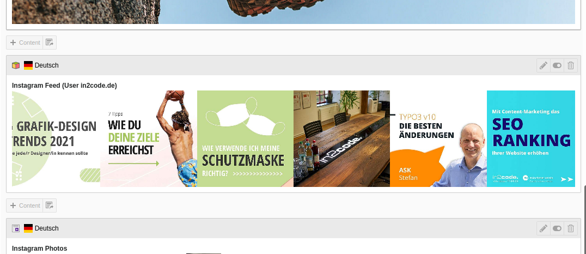

# Instagram feed from a profile in TYPO3

## Introduction

BBecause of the annoying Instagram API we searched for a simple way to show feed images without using any API. 
Inspired from the JavaScript plugin https://github.com/jsanahuja/InstagramFeed and there functionality we build 
the same with PHP.


## Explanation

An extension that is splitted into two parts. A scheduler where you can import an instagram feed into the database on
the one hand. On the other hand there is a plugin where you can show the feed on your page.


## Installation

`composer require in2code/instagram`


## Configuration

### Scheduler

Add a new scheduler task of type `Execute console commands (scheduler)` and select `instagram:importfeed`. Now you can
add a frequency (e.g. `0 0 */2 * *` for 48h), a instagram username and a limit.

Note: If the frequency is too high, the risk that instagram will block your server for a time is relative high. At the
moment I would not recommend less then once a day.


### HTML output modification

Overwrite and modify the HTML output:

```
plugin {
    tx_instagram_pi1 {
        view {
            templateRootPaths {
                0 = EXT:instagram/Resources/Private/Templates/
            }
        }
    }
}
```


Example html:

```
<html xmlns:f="http://typo3.org/ns/TYPO3/CMS/Fluid/ViewHelpers"
	  xmlns:instagram="http://typo3.org/ns/In2code/Instagram/ViewHelpers"
	  data-namespace-typo3-fluid="true">

<div class="c-socialwall">
	<div class="c-socialwall">
		<f:for each="{feed}" as="image" iteration="iteration">
			<f:if condition="{iteration.cycle} <= {settings.limit}">
				<div class="c-socialwall__item c-socialwall__item--instagram">
					<f:link.external uri="https://www.instagram.com/{settings.username}/" title="Instagram profile {settings.username}" target="_blank" rel="noopener">

						<instagram:isLocalImageExisting node="{image.node}">
							<f:then>
								<f:image src="/typo3temp/assets/tx_instagram/{image.node.shortcode}.jpg" alt="{image.node.accessibility_caption}" width="500c" height="500c" />
							</f:then>
							<f:else>
								
							</f:else>
						</instagram:isLocalImageExisting>

						<p>{image.node.edge_media_to_caption.edges.0.node.text}</p>
					</f:link.external>
				</div>
			</f:if>
		</f:for>
	</div>
</div>

</html>
```


## Screenshots





## Changelog

| Version    | Date       | State      | Description      |
| ---------- | ---------- | ---------- | ---------------- |
| 4.0.0 !!!  | 2020-11-13 | Task       | Add a scheduler task to import feeds (without RSS feed now). A plugin allows you to push the images into the frontend |
| 3.0.0 !!!  | 2020-06-05 | Task       | Use RSS-feed now for a workarround that server request are blocked by instagram |
| 2.0.0      | 2020-05-08 | Task       | Store images locally now to improve privacy of your visitors. Use content element uid for building individual caches now |
| 1.1.0      | 2020-04-29 | Task       | Open links in new tabs, don't cache the view because of own caching framework usage  |
| 1.0.0      | 2020-04-29 | Task       | Initial release  |
