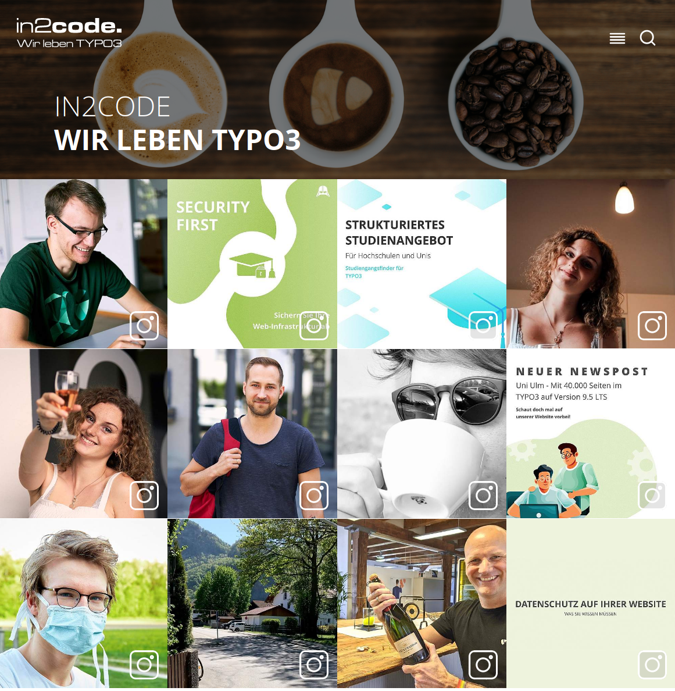

# Instagram feed from a profile in TYPO3

## Introduction

Because of the annoying Instagram API we searched for a simple way to show feed images without using any API. 
Inspired from https://github.com/rss-bridge/rss-bridge and there functionality we are using the same way as TYPO3
extension.


## Explanation

An extension that is splitted into two parts. A scheduler where you can import an instagram feed into the database on
the one hand. On the other hand there is a plugin where you can show the feed on your page.


## Installation

`composer require in2code/instagram`


## Configuration

### CLI commands

Import some posts from `in2code.de`:

`./vendor/bin/typo3 instagram:importfeed in2code.de`

Import some posts with a limit a session id (see FAQ for details) and get notified on errors via email:

`./vendor/bin/typo3 instagram:importfeed in2code.de 3 abcdef123456789abcdef service@in2code.de`

Import some posts and get notified about errors:

`./vendor/bin/typo3 instagram:importfeed in2code.de 0 '' service@in2code.de`

### Scheduler

Add a new scheduler task of type `Execute console commands (scheduler)` and select `instagram:importfeed`. Now you can
add a frequency (e.g. `0 0 */2 * *` for 48h), a instagram username and a limit.

**Note:** If the frequency is too high, the risk that instagram will block your anonymous requests from the server 
(because you do not use the official API) for some time is relative high. At the moment I would not recommend less 
then once a day. See FAQ below how to deal with blocked requests by using a valid session id.


| Field         | Description                                                                                                                               |
| ------------- | ----------------------------------------------------------------------------------------------------------------------------------------- |
| username      | Every task can import current posts from one user. If you want to show more feeds, you have to add more tasks.                            |
| limit         | Set a limit for your imported feeds to show as much posts as you want and store as less as it is needed.                                  |
| sessionid     | Optional: If your anonymous requests get blocked, you can use a sessionid to get feed details (see FAQ below).                            |
| receivers     | Optional: Get notified via email if a CURL error occurs (e.g. if instagram blocks your requests). Commaseparated email list is provided.  |

### HTML output modification

Overwrite and modify the HTML output:

```
plugin {
    tx_instagram_pi1 {
        view {
            templateRootPaths {
                0 = EXT:instagram/Resources/Private/Templates/
            }
        }
    }
}
```


Example html:

```
<html xmlns:f="http://typo3.org/ns/TYPO3/CMS/Fluid/ViewHelpers"
	  xmlns:instagram="http://typo3.org/ns/In2code/Instagram/ViewHelpers"
	  data-namespace-typo3-fluid="true">

<div class="c-socialwall">
	<div class="c-socialwall">
		<f:for each="{feed}" as="image" iteration="iteration">
			<f:if condition="{iteration.cycle} <= {settings.limit}">
				<div class="c-socialwall__item c-socialwall__item--instagram">
					<f:link.external uri="https://www.instagram.com/{settings.username}/" title="Instagram profile {settings.username}" target="_blank" rel="noopener">

						<instagram:isLocalImageExisting node="{image.node}">
							<f:then>
								<f:image src="/typo3temp/assets/tx_instagram/{image.node.shortcode}.jpg" alt="{image.node.accessibility_caption}" width="500c" height="500c" />
							</f:then>
							<f:else>
								
							</f:else>
						</instagram:isLocalImageExisting>

						<p>{image.node.edge_media_to_caption.edges.0.node.text}</p>
					</f:link.external>
				</div>
			</f:if>
		</f:for>
	</div>
</div>

</html>
```


## Screenshots

### Example frontend output: 



### Plugin in backend:


### Plugin overview in backend page module:


## FAQ

### Q: Feed cannot be imported

A: There are some possible reasons why a feed can not be imported (any more). To find out what's going on, you should
try to import the feed from CLI to get a valid message.

Import feed from user **in2code.de**

`./vendor/bin/typo3 instagram:importfeed in2code.de`

Possible error messages are

#### Reason: Could not fetch profile for "username" on "uri..."

A: Check if it is possible to read the instagram url (firewall settings) with a CURL request:

`curl -I "https://www.instagram.com/[username]/?__a=1"`

This should be possible

#### Reason: It seems that instagram blocked your anonymous request. You could pass a session id.

A: Instagram don't want that you read the JSON for your imports. So if you read those files too often, your IP is on
a blocklist. This means instagram wants you to login from now on. No worry, you can open your browser with an
anonymous tab and open the URL `https://www.instagram.com/accounts/login/` and login with your username and password.
Now, look into your cookie values, you will see a cookie with name "sessionid" and a value. Copy the value and close the
browser (do not log out). This should be valid for 12 month.
You can store the session id value into your scheduler task or simply pass it when connecting instagram:

`./vendor/bin/typo3 instagram:importfeed in2code.de 12 sessionIdValue`

#### Reason: Json array structure changed? Could not get value edge_owner_to_timeline_media

A: It could be that instagram changed the basic structure of their json file. This extension needs an update now.


## Changelog

| Version    | Date       | State      | Description      |
| ---------- | ---------- | ---------- | ---------------- |
| 5.0.0      | 2020-11-16 | Feature    | Pass a sessionid to instagram for blocked requests. Added a notification service for CURL errors. |
| 4.0.1      | 2020-11-14 | Bugfix     | Fix typo in ext_tables.sql |
| 4.0.0 !!!  | 2020-11-13 | Task       | Add a scheduler task to import feeds (without RSS feed now). A plugin allows you to push the images into the frontend |
| 3.0.0 !!!  | 2020-06-05 | Task       | Use RSS-feed now for a workarround that server request are blocked by instagram |
| 2.0.0      | 2020-05-08 | Task       | Store images locally now to improve privacy of your visitors. Use content element uid for building individual caches now |
| 1.1.0      | 2020-04-29 | Task       | Open links in new tabs, don't cache the view because of own caching framework usage  |
| 1.0.0      | 2020-04-29 | Task       | Initial release  |
